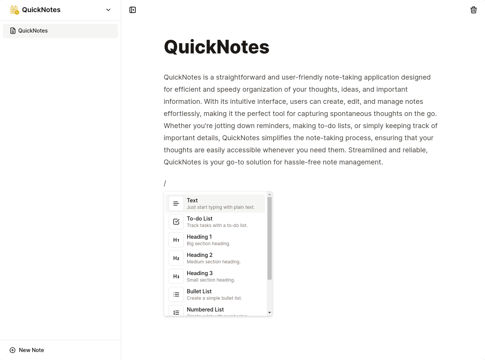

# QuickNotes

QuickNotes is a lightweight, user-friendly note-taking application designed to help you jot down and organize your thoughts, ideas, and important information quickly and efficiently.

## Features

- **Quick Notes**: Create and save notes in a matter of seconds. Perfect for capturing those spur-of-the-moment ideas.

- **Intuitive Interface**: The app boasts an intuitive and clean user interface, ensuring a seamless note-taking experience.

- **Rich Text Formatting**: Customize your notes with formatting options like bold, italics, and bullet points for clarity and style.

## Tech Stack

QuickNotes is built using the following technologies:

### Frontend

- **Next.js**

- **Shadcn**

### Authentication

- **Lucia**

### Database

- **Upstash**

- **Drizzle**

- **Neon DB**

## License

QuickNotes is released under the MIT License, which you can find in the LICENSE file.
